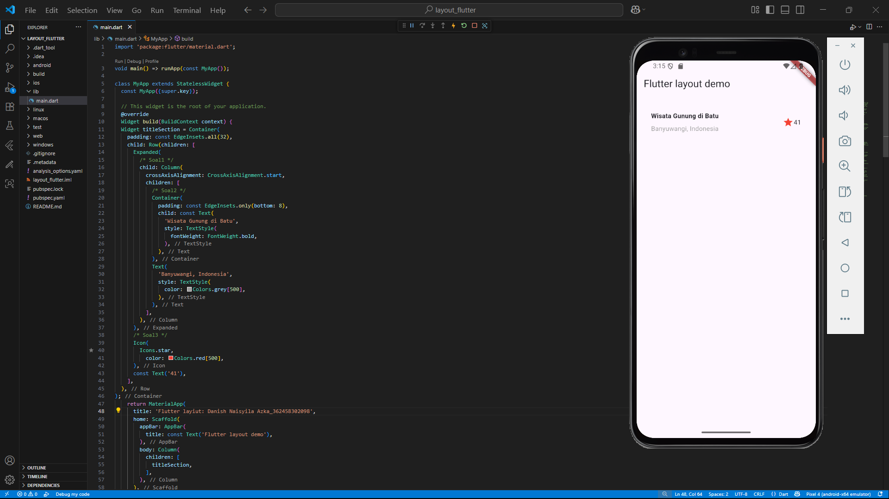

### NAMA  : DANISH NAISYILA AZKA
### NIM   : 362458302098
### KELAS : TRPL-2D

## <h1 align="center">LAPORAN PRAKTIKUM LAYOUT DAN NAVIGASI</h1>

Dalam praktikum ini dilakukan beberapa langkah utama, dimulai dari pembuatan project Flutter baru, pengaturan struktur folder, hingga penulisan kode dasar. Selanjutnya ditambahkan berbagai elemen antarmuka seperti teks, ikon, tombol, serta gambar untuk memperkaya tampilan aplikasi.

Sebelum membuat project baru kita buat file bernama layout_flutter terlebih dahulu, lalu open di Visual Studio Code.

Lalu kita ubah main.dart yang dari bawaan flutter. menggunakan MaterialApp sebagai kerangka utama, dengan judul Flutter layout: Danish Naisyila Azka_362458302098. Pada Scaffold, ditampilkan AppBar di atas dan teks "Hello World" di tengah layar.

Maka tampilannya akan seperti ini...

Berikutnya ditambahkan titleSection yang berisi judul Wisata Gunung Batu dan lokasi Banyuwangi, Indonesia. Di samping teks ada ikon bintang merah dengan angka 41 sebagai rating. Susunannya memakai Row dan Column

Kemudian dibuat fungsi _buildButtonColumn untuk menampilkan tombol berisi ikon dan teks. Fungsi ini digunakan agar mudah membuat tombol seperti CALL, ROUTE, dan SHARE. Tombol ditampilkan sejajar memakai Row sehingga terlihat rapi.

Kode ditambahkan bagian textSection yang berisi deskripsi tentang Danau Batur menggunakan widget text. Text ini dimasukkan ke dalam container dengan padding agar lebih rapi dan ditampilkan di bawah tombol CALL, ROUTE, dan SHARE. Dengan tambahan ini, aplikasi tidak hanya menampilkan judul dan tombol, tetapi juga deskripsidestinasi wisata.

Setelah itu file pubspec.yaml diubah dengan menambahkan bagian assets. Di dalamnya dimasukkan gambar Danau_batur.jpg, agar bisa dipanggil di aplikasi dengan image.asset.

Terakhir, aplikasi menampilkan gambar Danau Batur di atas. Lalu kita ganti nama "Wisata Gunung di Batu" menjadi "Wisata Danau Batur" Di bawahnya ada judul, rating, tombol interaktif, dan deskripsi. semua elemen disusun dalam ListView agar bisa digulir. Hasilnya, aplikasi tampil seperti aplikasi wisata sederhana yang memadukan gambar, teks, ikon, dan tombol.

Maka hasil akhirnya akan seperti ini...

